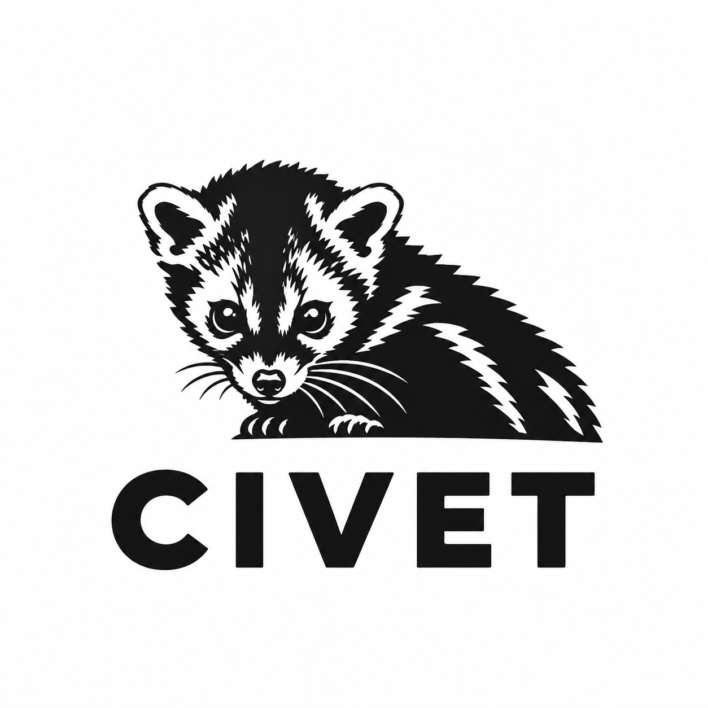

# civet

<p align="center">
  
</p>

<p align="center">
  Lean HTTP server written in C89 for POSIX systems. Serves static files and CGI programs from an in-memory virtual filesystem.
</p>

## Build

```sh
make
make install
```

For a build with runtime debug logging:

```sh
make DEBUG=1
```

## Quick start
First make sure to compile the hello.bin:

```sh
cd example
make
cd ..
```


Serve `./example/website` on `127.0.0.1:8080` and cache two files in memory:

```sh
./civet -r ./example/website/ -c cgi-bin/hello.bin,index.html
civet: indexed 9 entries
civet: cached /cgi-bin/hello.bin (19112 bytes)
civet: cached /index.html (943 bytes)
civet: cache contains 2 files (20055 bytes, 256 MiB max)
civet: virtual filesystem:
  //
  /about.html
  /build.html
  /cgi-bin/
  /cgi-bin/hello.bin
  /civet.html
  /features.html
  /index.html
  /logo.png
civet: serving /root/civet/example/website on http://127.0.0.1:8080/
civet: listening on 127.0.0.1:8080
```

* `-r` is the document root.
* `-p` is the port.
* `-b` is the bind address.
* `-c` is a list of files to load into RAM at startup. Cached files are served straight from memory.

Startup output:

```text
civet: indexed 3 filesystem entries
civet: cached /index.html (1234 bytes)
civet: cached /other_page.html (2345 bytes)
civet: cache contains 2 files (3579 bytes)
civet: virtual filesystem:
/
|-- index.html
|-- other_page.html
civet: 1 directories, 2 files
civet: serving /path/to/test on http://127.0.0.1:8080/
civet: listening on 127.0.0.1:8080
civet: serving /path/to/test
```

## Features

* HTTP/1.0 and HTTP/1.1 request parsing
* Static files over `GET` and `HEAD`; other methods get `405`
* CGI under `/cgi-bin/` with `GET`, `HEAD`, `POST`, `PUT`, `PATCH` and `DELETE`
* One detached thread per connection, with a configurable thread limit
* `Expect: 100-continue` support
* Socket and request timeouts
* In-memory virtual filesystem index
* Optional in-memory file cache
* Directory `index.html` support
* MIME type detection
* Configurable bind address and port

## CGI

Executables under `/cgi-bin/` are run as CGI programs. The request body is passed on stdin.

Environment passed to the program:

```text
GATEWAY_INTERFACE  SERVER_SOFTWARE  SERVER_PROTOCOL
SERVER_NAME        SERVER_PORT
REQUEST_METHOD     SCRIPT_NAME      SCRIPT_FILENAME   QUERY_STRING
CONTENT_TYPE       CONTENT_LENGTH
REMOTE_ADDR        PATH
HTTP_*             request headers (User-Agent -> HTTP_USER_AGENT, etc.)
```

`example/` has a small test CGI (`hello.c`) with a `Makefile`:

```sh
cd example
make                          # builds website/cgi-bin/hello.bin
civet -r ./website -p 8080    # open http://127.0.0.1:8080/cgi-bin/hello.bin
```

`make clean` removes the built binary.

## Requirements

* POSIX system
* C compiler
* `make`

## Size

Version 0.0.3, x86-64, built with musl:

```text
binary:     89,336 bytes
text:       70,055 bytes
data:        1,232 bytes
bss:           456 bytes
total:      71,743 bytes (70.1 KiB)
```

## License

See the project source for license information.
